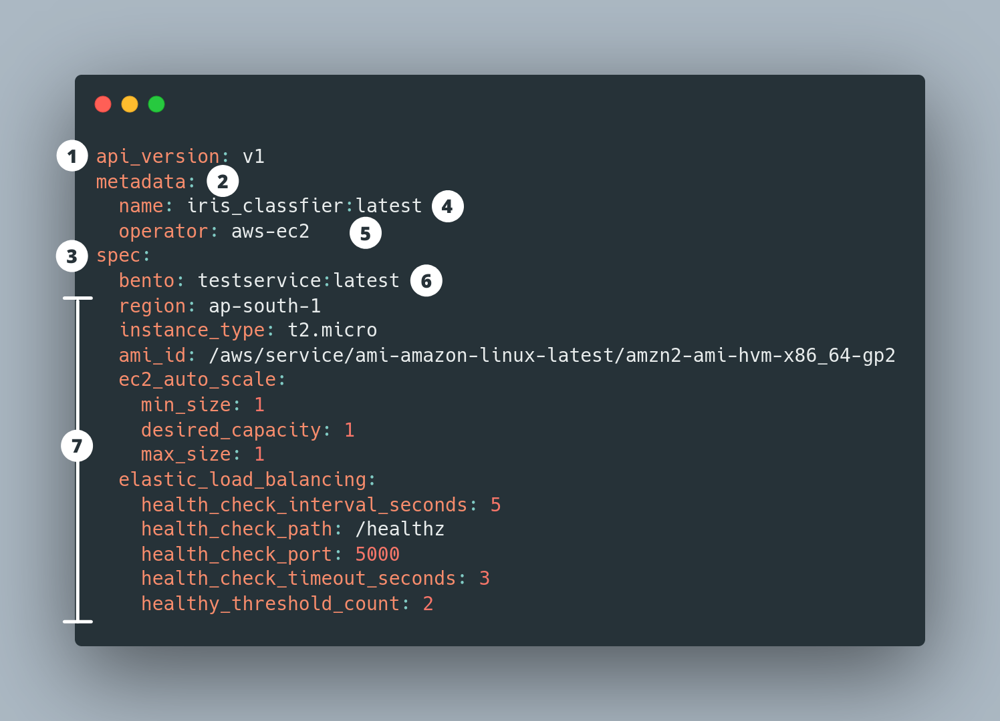

# Core Concepts

Bentoctl performs two types of operations:

1. bentoctl manages the operators that interact with the cloud service.
2. bentoctl mangages the deployment via deployment configurations.

In the following sections, we will discuss the concepts of operators and deployment configurations.

## Operators

Operators are plugins that interact with the external services, typcially a cloud service. It abstracts the specifics implmentation details of the external service and provides an unified interface for bentoctl. The operator provide 4 core actions that are:

1. Deploy - Create Deployment in the external service base on the deployment configuration provided by the user.
2. Describe - Retrieve the latest deployment status and properties from the external service.
3. Update - Update the deployment configuration in the external service.
4. Delete - Remove the deployment from the external service.

The operator also provides a set of schema that bentoctl uses to validate the deployment configuration. [Operators](./operators.md) page provides more details on supported platforms and their current status.

The operator designed to be customizable and extensible. Users can install non-offical operators from git url or from a local file path. Users can create their own operator from the [operator template on Github](https://github.com/bentoml/bentoctl-operator-template).

## Deployment Configuration

bentoctl uses deployment configuration to specify the deployment properties. The deployment configuration stores in local system using yaml format

### An Anatomy of a Deployment Config file

Here is a sample deployment config for the EC2 operator.

1 :- `api_version` specifies deployment configuration version.

2 :- `metadata` contains the base information about the deployment.

3 :- `spec` specifics the deployment details. The deployment detail options are provided by the operator listed in the metadata section.

4. `metadata.name` - Deployment's name. bentoctl recommends to keep deployment name unqiue within each operator to avoid any potential issues.

5. `metadata.operator` - Operator used for the deployment. bentoctl will automatically install official operator if it is not installed.

6. `spec.bento` - Bento used for the deployment. This field's value is expecting in a string in the format of `bento:<bento_name>:<bento_version>`.

7. `spec.*` - Deployment options specific to the operator.
