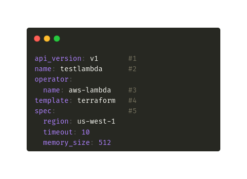

# Core Concepts

## Why bentoctl?

The goal of bentoctl is to provide an easy-to-use yet flexible tool that can be used used to deploy a bento into the cloud. Bentoctl performs two basic operations:
1. bentoctl builds deployable images or artifacts based on the cloud service's requirements.
2. bentoctl creates and manages cloud service deployment with Terraform

## Operators

Operators are plugins that interact with the external services, typically a cloud service. It abstracts the specific implementation details of the external service and provides a unified interface for bentoctl. The operator provides 3 core actions that are:

1. Create a deployable image or artifact based on the cloud service's requirements.
2. Manage the registries provided by the cloud service.
3. Generate Terraform projects based on the deployment configuration.

The operator also provides a set of schema that bentoctl uses to validate the deployment configuration. [Operators](./cloud-deployment-reference/) page offers more details on supported platforms.

The operator is designed to be customizable and extensible. Users can install non-official operators from a local file path. Users can create their own operator from the [operator template on Github](https://github.com/bentoml/bentoctl-operator-template).

## Deployment Configuration

bentoctl uses deployment configuration to specify the deployment properties. The deployment configuration is stored in the local system as a YAML file.

### An Anatomy of a Deployment Config file

Here is a sample deployment config for the EC2 operator.

  

1:- `api_version` specifies the deployment configuration version.

2:- `name` Deployment's name. bentoctl recommends keeping the deployment name unique within each operator to avoid potential issues.

3:- `operator.name` - The name of the operator used for deployment, see the list of [official operatos](./operator-list.md) supported. If the operator is not installed it is installed for you based on the version provided. You can also provide a path to the operator if it is in the local directory. This is helpful if using custom operators.

4:- `operator.version` (optional) - The version of the operator to use. The default is to use the latest.

5:- `template` The template for the deployment. It determines what the generated terraform project will look like.

6:- `spec` specifics the deployment details. The deployment detail options are provided by the operator listed.

## Terraform

Bentoctl uses terraform to define the infrastructure and create the various
components that are required. Terraform is a mature and popular infrastructure
as code (IaC) solution. There were a few reasons why we choose Terraform. 
1. it has a huge collection of plugins (or providers as terraform calls it) that
   bentoctl operators can leverage. With this, you can write custom operators
   that can deploy to any cloud service that has a provider in the [terraform
   registry](https://registry.terraform.io/browse/providers). Terraform
   providers are also maintained and constantly updated with the latest
   offerings and features that the cloud service providers add. 
2. Terraform is widely used and there are more resources available. This is
   helpful when looking to extend the generated files to your specific needs.
3. It also gives a unified language and way to specify various cloud components
   across the different cloud services SaaS solutions out there. This makes
   building and maintaining operators and adding more cloud service-specific
   features easier.

Bentoctl generates the terraform files for the cloud service and is designed to
be modified if need be. Each team will have different requirements for
deployment. 
