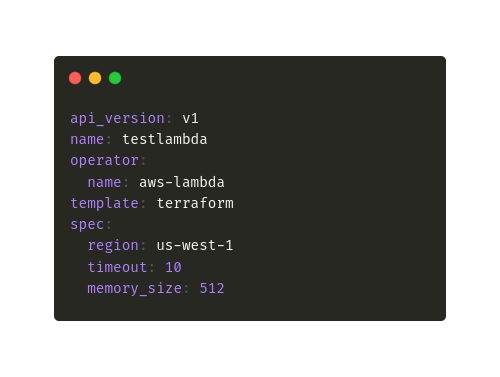

# Core Concepts

Bentoctl has two responsibilities. Firstly it manages the operators in the local system that interact with the cloud services and performs the various commands. Secondly, it facilitates bento deployment to cloud services which are configured by the Deployment Config. The core concepts guide will help users to understand what are operator and deployment configurations and how they work.

## Operators

Operators are plugins that interact with the cloud services to perform the bentoctl commands. It abstracts away the specifics of the cloud service and provides bentoctl with a unified interface to perform the major actions. The Operator has 4 main actions that it should perform that are directly related to the 4 major commands of the bentoctl CLI.

1. Deploy - build, push and deploy the bento to the cloud service to create the endpoint.
2. Describe - get the properties and current status of the deployment.
3. Update - make changes to the service to reflect the latest bento service or configuration change. For some cloud providers (like AWS) this can be performed by the deploy command also.
4. Delete - clean up all the resources created for the deployment.

Official operators that support the major cloud services and you can see the list in the [Operator List](./operator-list.md) page.

You can also create your own operators. Use the [operator template](https://github.com/bentoml/bentoctl-operator-template) as the base for your operator. Refer to the operator template documentation for more information on the internal workings of operators. Feel free to reach out via slack (channel: #cloud-deployment) in case of any assistance required.

## Deployment Configuration

Deployments in bentoctl are defined by the deployment configuration. This YAML file specifies everything bentoctl needs to carry out the deployment and represents the configuration for the cloud service.

### An Anatomy of a Deployment Config file

Here is a sample deployment config for the EC2 operator. Let's discuss the major parts.

1 :- `api_version` specifies deployment configuration version.  

2 :- `metadata` contains information about the deployment such as the deployment name and operators that it uses. 

3 :- `spec` is the specification of the deployment. The available deployment options are provided by the operator in the metadata section.

  

1. `metadata.name` - this is the deployment name that is used to name all the resources created in the cloud service. The deployment name and operator combination should be unique to avoid any potential problems.
2. `metadata.operator` - the operator that is used to deploy the bento. The operator has to be available in bentoctl locally. 
3. `spec.bento` - the bento service that is deployed to the cloud service. This is a required field for every operator.
4. `spec.*` - other configuration options that depend on the operator used.
