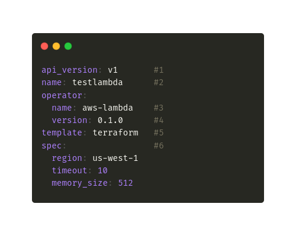

# Core Concepts

Bentoctl performs two types of operations:

1. bentoctl builds deployable images or artifacts based on the cloud services' requirements.
2. bentoctl managages cloud service deployment with Terraform

In the following sections, we will discuss the concepts of operators and deployment configurations.

## Operators

Operators are plugins that interact with the external services, typcially a cloud service. It abstracts the specifics implmentation details of the external service and provides an unified interface for bentoctl. The operator provide 2 core actions that are:

1. Create deployable image or artifact base on the cloud service's requirements.
2. Generate Terraform projects based on the deployment configuration.

The operator also provides a set of schema that bentoctl uses to validate the deployment configuration. [Operators](./operators.md) page provides more details on supported platforms and their current status.

The operator designed to be customizable and extensible. Users can install non-offical operators from git url or from a local file path. Users can create their own operator from the [operator template on Github](https://github.com/bentoml/bentoctl-operator-template).

## Deployment Configuration

bentoctl uses deployment configuration to specify the deployment properties. The deployment configuration stores in local system using yaml format

### An Anatomy of a Deployment Config file

Here is a sample deployment config for the EC2 operator.

  

1 :- `api_version` specifies deployment configuration version.

2 :- `name` Deployment's name. bentoctl recommends to keep deployment name unqiue within each operator to avoid any potential issues.

3 :- `operator` Operator used for the deployment. bentoctl will automatically install official operator if it is not installed.

4 :- `template` The template for the deployment. It determines what the generated terraform project will look like.

5 :- `spec` specifics the deployment details. The deployment detail options are provided by the operator listed.

6 :- `spec.*` - Deployment options specific to the operator.
